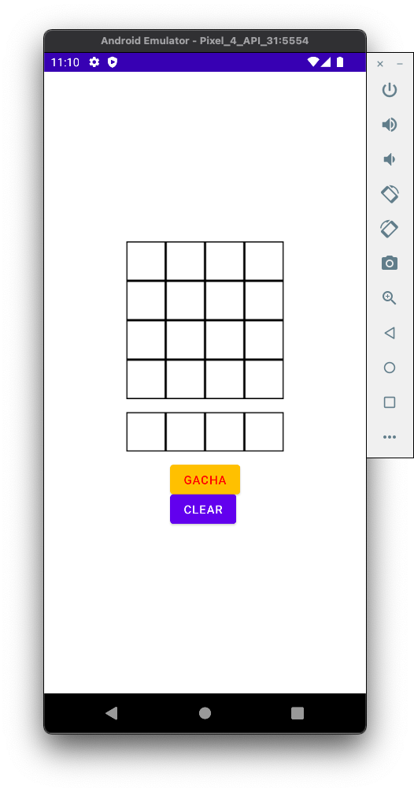

# 情報工学実験：モバイルアプリケーション開発
- [情報工学実験：モバイルアプリケーション開発](#情報工学実験モバイルアプリケーション開発)
    - [目的](#目的)
    - [実験の概要](#実験の概要)
    - [実験の実施内容](#実験の実施内容)
        - [開発したアプリケーションの概要](#開発したアプリケーションの概要)
        - [使用した技術](#使用した技術)
        - [分担](#分担)
        - [プログラムの構成](#プログラムの構成)
        - [作成したソースコード](#作成したソースコード)
    - [感想](#感想)
    - [参考](#参考)
- [付録：ソースコード一覧](#付録ソースコード一覧)
    - [`repository/`](#repository)
    - [`viewmodel`](#viewmodel)
    - [`view`](#view)
    - [`ui/theme`](#uitheme)

## 目的
- スマートフォン用アプリケーションソフトウェアを開発するために必要な基礎知識・技術を学ぶ

## 実験の概要
- Android端末向けにアプリケーションを開発する。開発環境としてAndroid Studioを使用する。

## 実験の実施内容
### 開発したアプリケーションの概要
今回開発したアプリケーションは、ランダムに表示される画像の断片を組み合わせ、画像を完成させるパズルゲームであり、名称は "Puzzle And Pictures"である。


画面はつぎに示される画像の通りで、画面中央部の4x4のマス目が"パズルエリア"、その下の横一列にマス目が4つ並んだ部分が画像の断片が表示される"ガチャエリア"、最下部の2つのボタンはそれぞれ、"ガチャボタン"、"クリアボタン"である。



それぞれ次のような機能を持つ。
- パズルエリア
    - ガチャエリアに表示された画像を配置しパズルを完成させる部分。
- ガチャエリア
    - パズルに使用する画像の断片が4枚表示される。
- ガチャボタン
    - 押すことでガチャエリアに4枚の画像の断片を無作為に表示する。
- クリアボタン
    - パズルエリアの表示を初期化する。


ユーザは次のようにしてアプリを使用する。
1. ガチャボタンをタップする。
1. ガチャエリアに表示された画像のうち1つをタップし選択する。
1. 選択した写真を配置する場所をパズルエリアから選択する。
1. もし配置する場所を間違えた場合、クリアボタンでパズルエリアを初期化する。
1. もしガチャエリアに置きたい写真がなくなった場合、ガチャボタンをタップし2に戻る。

### 使用した技術
本アプリケーションはJetPack Composeを用い、Kotlinで記述し開発した。プログラムの構成はModel View ViewModel(MVVM)アーキテクチャに沿うようにした。
また開発環境としてAndroid Studio Arctic Foxを使用した。


### 分担
初期のアイデアは佐藤が考案し、またパズルエリアのモデルの作成をした。 伊藤と大内はデザインの定義とレイアウトの作成を担当した。 芳賀はおおまかな設計の提案と他3名が作成した部品の統合を担当した。

次に各班員が作成したファイルを示す。
- 伊藤：`view/GachaView.kt`
- 大内：`ui/theme/Color.kt`、`view/ButtonView.kt`
- 佐藤：`repository/MainPictureRepository.kt`
- 芳賀：`repository/GachaRepository.kt`, `viewmodel/MainViewModel.kt`, `view/MainView.kt`, その他データクラス、ユーティリティ関数の定義


### プログラムの構成
プロジェクトのファイル群はGitHubリポジトリ[straxFromIbr/PuzzleAndPictures](https://github.com/straxFromIbr/PuzzleAndPictures/tree/b7f41946681e5006868df870e1d6d353433cc5fa)にアップロードしてある。

以下にディレクトリの構成の概観を示す。
- `PuzzleAndPictures/app/src/main/java/com/example/puzzleandpictures/`:ソースコードのルート
    - `repository/` 
        - MVVMのModel部分に相当する、ドメインロジックへのインタフェースを提供する。
        - `GachaRepository.kt` はガチャエリアに表示される画像のIDを生成する。
        - `MainPictureRepository.kt` はパズルエリアの画像の状態の保持と更新を行う。
    - `ui/theme/`
        - 色彩などを定義している。
    - `viewmodel/`
        - MVVMのViewModel部分に相当する。
        - `repository/`への参照を持ち、ユーザのアクション時に呼び出される関数と、モデルの操作を対応づけている。
    - `view/`
        - MVVMのView部分に相当する。
        - ViewModelへの参照を持ち、画面に表示される部品や、ボタンのクリックなどのアクション時にViewModelの対応するメソッドの呼び出しを定義する。
        - `MainView.kt`で画面全体を定義している。
    - `MainActivity.kt`
        - ViewModelをインスタンス作成し、`MainView`関数に渡して呼び出している。
        
また`repository/`内で次の2つのデータクラスを実装した。
- `RowPicIDs`
    -これはガチャエリアやパズルエリアの各行の、横一列に4つ並ぶ画像のIDを保持するためのデータクラスである。
    ```kotlin
    data class RowPicIDs (
        var a: Int = -1,
        var b: Int = -1,
        var c: Int = -1,
        var d: Int = -1,
    )
    ```
- `MainPictureIDs`
    - これはパズルエリア全体の画像のIDを保持するためのデータクラスである。

    ```kotlin
    data class MainPictureIDs(
        val row1: RowPicIDs = RowPicIDs(),
        val row2: RowPicIDs = RowPicIDs(),
        val row3: RowPicIDs = RowPicIDs(),
        val row4: RowPicIDs = RowPicIDs(),
    )
    ```


また、パズルで使用した画像ファイルは`PuzzleAndPictures/app/src/main/res/drawable`にJPEGで保存している。

### 作成したソースコード
次に作成を担当したしたソースコードの抜粋を示す。
全ファイルは[straxFromIbr/PuzzleAndPictures](https://github.com/straxFromIbr/PuzzleAndPictures/tree/b7f41946681e5006868df870e1d6d353433cc5fa)で参照できる。

- `repository/GachaRepository.kt`
    - 乱数で初期化されたRowPicIDsデータクラスを返却する。

    ```kotlin
    package com.example.puzzleandpictures.repository
    class GachaRepository {
        fun doGacha(): RowPicIDs {
            val range = (0..15)
            return RowPicIDs(range.random(), range.random(), range.random(), range.random())
        }
    }
    ```

- `viewmodel/MainViewModel.kt`
    - UIへの操作に応じてモデルのメソッドを呼び出している。
    ```kotlin
    package com.example.puzzleandpictures.viewmodel

    // import文は省略した

    class MainViewModel() : ViewModel() {
        // モデルのインスタンス作成
        // 時間の都合上DIは実施していない。
        private val mainPictureRepository: MainPictureRepository = MainPictureRepository()
        private val gachaRepository: GachaRepository = GachaRepository()

        private var selectedPicID: Int = 16
        private var isPicSelected = false

        val gachaResultIDs: MutableState<RowPicIDs> = mutableStateOf(RowPicIDs())
        val mainPictureIDs: MutableState<MainPictureIDs> = mutableStateOf(MainPictureIDs())

        fun onGachaTapped() {
            // ガチャボタンがタップされた時の処理
            gachaResultIDs.value = gachaRepository.doGacha()
        }

        fun onPicSelected(imageID: Int) {
            // ガチャエリアから画像が選択された時の処理
            selectedPicID = imageID
            isPicSelected = true
        }

        fun onPlaceSelected(placeID: Int) {
            // パズルエリアに写真を配置する場所を選択した時の処理
            if (isPicSelected) {
                val resultArray = mainPictureRepository.Place_Pic(selectedPicID, placeID)
                mainPictureIDs.value = convertArrayToAllPicIDs(resultArray)
                isPicSelected = false
            }
        }

        fun onClearTapped() {
            // クリアボタンが押された時の処理
            mainPictureRepository.Clear()
            mainPictureIDs.value = convertArrayToAllPicIDs(mainPictureRepository.current_pic)
        }

        private fun convertArrayToAllPicIDs(array16: IntArray): MainPictureIDs {
            // MainPictureRepositoryの返り値をMainPictureIDs型に変換する処理
            val row0 = RowPicIDs(array16[0], array16[1], array16[2], array16[3])
            val row1 = RowPicIDs(array16[4], array16[5], array16[6], array16[7])
            val row2 = RowPicIDs(array16[8], array16[9], array16[10], array16[11])
            val row3 = RowPicIDs(array16[12], array16[13], array16[14], array16[15])
            return MainPictureIDs(row0, row1, row2, row3)
        }
    }
    ```

    - `view/MainView.ky`
        - 引数として与えられたViewModelのプロパティとメソッドを各UI部品に渡している。
            
    ```kotlin
    package com.example.puzzleandpictures.view

    @Composable
    fun MainView(mainViewModel: MainViewModel) {
        val mainPictureIDs: MainPictureIDs by mainViewModel.mainPictureIDs
        val gachaResultIDs: RowPicIDs by mainViewModel.gachaResultIDs

        val padding = 16.dp

        Column(
            Modifier.fillMaxSize(),
            verticalArrangement = Arrangement.Center,
            horizontalAlignment = Alignment.CenterHorizontally,
        ) {
            MainPictureView(
                mainPictureIDs,
                mainViewModel::onPlaceSelected
            )
            Spacer(Modifier.size(padding))
            GachaResultView(
                rowPicIDs = gachaResultIDs,
                onPicSelected = mainViewModel::onPicSelected
            )
            Spacer(Modifier.size(padding))
            ShowButtons(
                onGachaTapped = mainViewModel::onGachaTapped,
                onClearTapped = mainViewModel::onClearTapped,
            )
        }
    }
    ```

## 感想
以前簡易的なAnbdroidアプリケーションを作成したときは個人開発であり、MainActivityにほとんどの処理を書くような乱暴な設計でもさほど問題にならなかった。しかし複数人で分担して開発するときには、アプリケーションを構成する機能を分割し、それぞれが過度に依存しすぎないような設計をする必要があると実感した。
反省点としては、今回のアプリケーションはドメインロジックが簡単であった反面ViewModelのメソッドを孫コンポーネントまでバケツリレーのように渡していくなど、Viewの部分が複雑になってしまったこと、また、事前の取り決めが甘く、データの型がまちまちになってしまったことが挙げられる。


## 参考
- Jetpack ComposeによるAndroid MVVMアーキテクチャ入門, 奥澤 俊樹

# 付録：ソースコード一覧
以下にkotlinファイルを掲載する。

## `repository/`
-  `GachaRepository.kt`
```kotlin
package com.example.puzzleandpictures.repository
class GachaRepository {
    fun doGacha(): RowPicIDs {
        val range = (0..15)
        return RowPicIDs(range.random(), range.random(), range.random(), range.random())
    }
}
```

- `MainPictureRepository`
```kotlin
package com.example.puzzleandpictures.repository

class MainPictureRepository {
    //current_picの値は16個の配列
    //初期値として透明の画像に対応するidをcurrent_picに代入
    var current_pic = IntArray(16) { 16 }
    init {
        //println("initialize current_pic")
        Clear()
        //println(current_pic[3])
    }
    //すべてのメイン画像を透明に変更
    fun Clear() {
        current_pic = IntArray(16) { 16 }
    }

    //ガチャ画面で選択された画像のidを取得して、現在の盤面のどこに入力を行うのか実行する
    fun Place_Pic(selected_picture_id: Int, Place_id: Int): IntArray {
        current_pic[Place_id] = selected_picture_id
        // println(current_pic[Place_id])
        return current_pic
    }

    //現在の画像の配置状態を配列で表示
    fun show_current_pic() {
        println(current_pic.contentToString())
    }

    //すべてのタイルに画像がすべて埋まっている場合
    fun is_all_placed(): Boolean {
        //もしcurrent_picの中にまだ埋まっていない画像がある場合はtrueを返します
        return current_pic.contains(16)
    }
}
```

- `RowPicIDs.kt`
```kotlin
package com.example.puzzleandpictures.repository
data class RowPicIDs (
    var a: Int = -1,
    var b: Int = -1,
    var c: Int = -1,
    var d: Int = -1,
)
```

- `MainPictureIDs.kt`
```kotlin
package com.example.puzzleandpictures.repository

data class MainPictureIDs(
    val row1: RowPicIDs = RowPicIDs(),
    val row2: RowPicIDs = RowPicIDs(),
    val row3: RowPicIDs = RowPicIDs(),
    val row4: RowPicIDs = RowPicIDs(),
)
```

## `viewmodel`
- `MainViewModel.kt`
```kotlin
package com.example.puzzleandpictures.viewmodel

import androidx.compose.runtime.MutableState
import androidx.compose.runtime.mutableStateOf
import androidx.lifecycle.ViewModel
import com.example.puzzleandpictures.repository.GachaRepository
import com.example.puzzleandpictures.repository.MainPictureIDs
import com.example.puzzleandpictures.repository.MainPictureRepository
import com.example.puzzleandpictures.repository.RowPicIDs

class MainViewModel() : ViewModel() {
    // DIは実施していない
    private val mainPictureRepository: MainPictureRepository = MainPictureRepository()
    private val gachaRepository: GachaRepository = GachaRepository()

    // ガチャ画面
    /// 選択された写真ID
    private var selectedPicID: Int = 16
    private var isPicSelected = false

    /// ガチャ結果データ
    val gachaResultIDs: MutableState<RowPicIDs> = mutableStateOf(RowPicIDs())

    // 現在表示されてる画像
    val mainPictureIDs: MutableState<MainPictureIDs> = mutableStateOf(MainPictureIDs())


    fun onGachaTapped() {
        gachaResultIDs.value = gachaRepository.doGacha()
    }

    fun onPicSelected(imageID: Int) {
        selectedPicID = imageID
        isPicSelected = true
    }

    fun onPlaceSelected(placeID: Int) {
        if (isPicSelected) {
            val resultArray = mainPictureRepository.Place_Pic(selectedPicID, placeID)
            mainPictureIDs.value = convertArrayToAllPicIDs(resultArray)
            isPicSelected = false
        }
    }

    fun onClearTapped() {
        mainPictureRepository.Clear()
        mainPictureIDs.value = convertArrayToAllPicIDs(mainPictureRepository.current_pic)
    }

    private fun convertArrayToAllPicIDs(array16: IntArray): MainPictureIDs {
        val row0 = RowPicIDs(array16[0], array16[1], array16[2], array16[3])
        val row1 = RowPicIDs(array16[4], array16[5], array16[6], array16[7])
        val row2 = RowPicIDs(array16[8], array16[9], array16[10], array16[11])
        val row3 = RowPicIDs(array16[12], array16[13], array16[14], array16[15])
        return MainPictureIDs(row0, row1, row2, row3)
    }

}

```

## `view`
- `ButtonView.kt`
```kotlin
package com.example.puzzleandpictures.view

import androidx.compose.foundation.layout.Column
import androidx.compose.material.Button
import androidx.compose.material.ButtonDefaults
import androidx.compose.material.Text
import androidx.compose.runtime.Composable
import com.example.puzzleandpictures.ui.theme.Gold
import com.example.puzzleandpictures.ui.theme.Red

@Composable
fun GachaButton(
    onGachaTapped: () -> Unit
) {
    Button(
        onClick = {onGachaTapped()},
        colors = ButtonDefaults.textButtonColors(
            backgroundColor = Gold,
            contentColor = Red,
        )
    ) { Text(text = "GACHA") }
}

@Composable
fun ClearButton(
    onClearTapped: () -> Unit,
) {
    Button(onClick = {onClearTapped()})
    { Text(text = "CLEAR") }
}

@Composable
fun ShowButtons(
    onGachaTapped: () -> Unit,
    onClearTapped: () -> Unit,
) {
    Column {
        GachaButton(onGachaTapped)
        ClearButton(onClearTapped)
    }
}
```
- `GachaView.kt`
```kotlin
package com.example.puzzleandpictures.view

import androidx.compose.foundation.layout.Column
import androidx.compose.foundation.layout.Row
import androidx.compose.material.IconButton
import androidx.compose.runtime.Composable
import com.example.puzzleandpictures.repository.RowPicIDs

@Composable
fun GachaResultView(
    rowPicIDs: RowPicIDs,
    onPicSelected: (imageID: Int) -> Unit
) {
    Column {
        Row {
            IconButton(onClick = { onPicSelected(rowPicIDs.a) }) {
                ImageChoose(imageID = rowPicIDs.a)
            }
            IconButton(onClick = { onPicSelected(rowPicIDs.b) }) {
                ImageChoose(imageID = rowPicIDs.b)
            }
            IconButton(onClick = { onPicSelected(rowPicIDs.c) }) {
                ImageChoose(imageID = rowPicIDs.c)
            }
            IconButton(onClick = { onPicSelected(rowPicIDs.d) }) {
                ImageChoose(imageID = rowPicIDs.d)
            }
        }
    }
}
```

- `MainPictureView.kt`
```kotlin
package com.example.puzzleandpictures.view

import androidx.compose.foundation.layout.Column
import androidx.compose.foundation.layout.Row
import androidx.compose.material.IconButton
import androidx.compose.runtime.Composable
import com.example.puzzleandpictures.repository.MainPictureIDs
import com.example.puzzleandpictures.repository.RowPicIDs

@Composable
fun MainPictureView(
    mainPictureIDs: MainPictureIDs,
    onPlaceSelected: (placeID: Int) -> Unit
) {
    Column {
        RowPicView(mainPictureIDs.row1, 0, onPlaceSelected)
        RowPicView(mainPictureIDs.row2, 4, onPlaceSelected)
        RowPicView(mainPictureIDs.row3, 8, onPlaceSelected)
        RowPicView(mainPictureIDs.row4, 12, onPlaceSelected)
    }
}

@Composable
fun RowPicView(
    rowPicIDs: RowPicIDs,
    rowID: Int,
    onPlaceSelected: (placeID: Int) -> Unit
) {
    Column {
        Row {
            IconButton(onClick = { onPlaceSelected(rowID + 0) }) {
                ImageChoose(imageID = rowPicIDs.a)
            }
            IconButton(onClick = { onPlaceSelected(rowID + 1) }) {
                ImageChoose(imageID = rowPicIDs.b)
            }
            IconButton(onClick = { onPlaceSelected(rowID + 2) }) {
                ImageChoose(imageID = rowPicIDs.c)
            }
            IconButton(onClick = { onPlaceSelected(rowID + 3) }) {
                ImageChoose(imageID = rowPicIDs.d)
            }
        }
    }
}
```

- `MainView.kt`
```kotlin
package com.example.puzzleandpictures.view

import androidx.compose.foundation.layout.*
import androidx.compose.runtime.Composable
import androidx.compose.runtime.getValue
import androidx.compose.ui.Alignment
import androidx.compose.ui.Modifier
import androidx.compose.ui.unit.dp
import com.example.puzzleandpictures.repository.MainPictureIDs
import com.example.puzzleandpictures.repository.RowPicIDs
import com.example.puzzleandpictures.viewmodel.MainViewModel

@Composable
fun MainView(mainViewModel: MainViewModel) {
    val mainPictureIDs: MainPictureIDs by mainViewModel.mainPictureIDs
    val gachaResultIDs: RowPicIDs by mainViewModel.gachaResultIDs

    val padding = 16.dp

    Column(
        Modifier.fillMaxSize(),
        verticalArrangement = Arrangement.Center,
        horizontalAlignment = Alignment.CenterHorizontally,
        ) {
        Row() {
            MainPictureView(
                mainPictureIDs,
                mainViewModel::onPlaceSelected
            )
        }
        Spacer(Modifier.size(padding))

        GachaResultView(
            rowPicIDs = gachaResultIDs,
            onPicSelected = mainViewModel::onPicSelected
        )

        Spacer(Modifier.size(padding))

        ShowButtons(
            onGachaTapped = mainViewModel::onGachaTapped,
            onClearTapped = mainViewModel::onClearTapped,
        )
    }
}
```

## `ui/theme`
- `Color.kt`
```kotlin
package com.example.puzzleandpictures.ui.theme

import androidx.compose.ui.graphics.Color

val Purple200 = Color(0xFFBB86FC)
val Purple500 = Color(0xFF6200EE)
val Purple700 = Color(0xFF3700B3)
val Teal200 = Color(0xFF03DAC5)
val Gold = Color(0xFFFFC000)
val Red = Color(0xFFFF0000)
val Green = Color(0xFF00FF00)
```